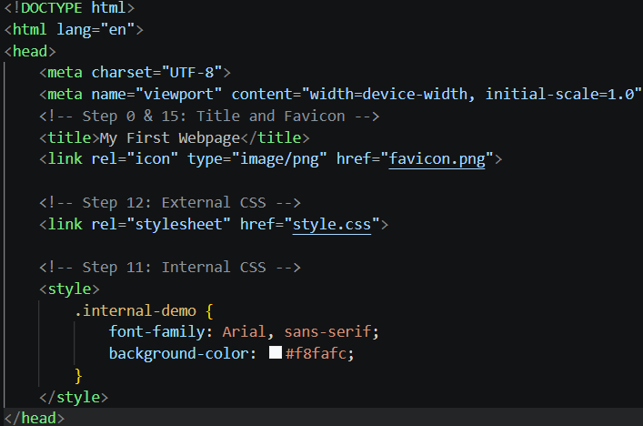
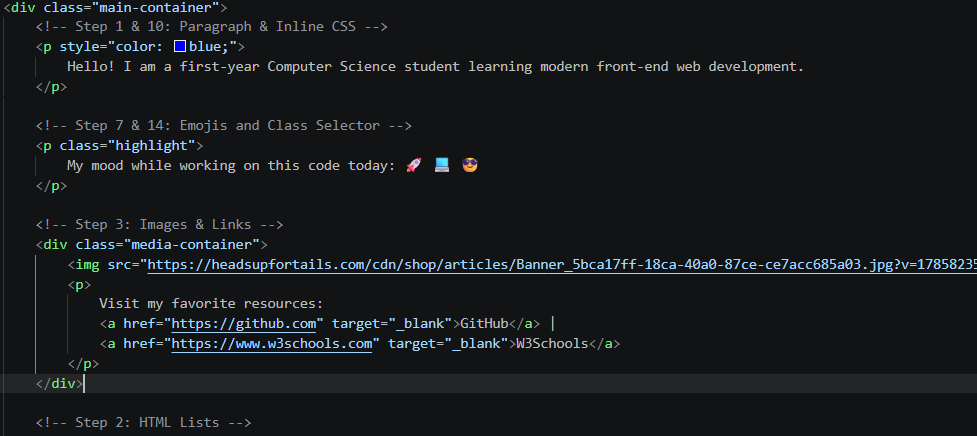
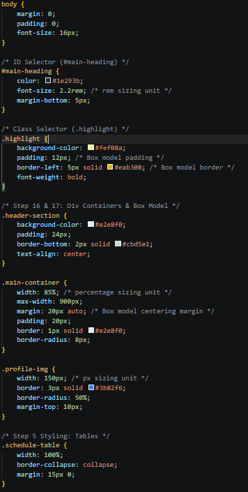

# Assignment #1: HTML & CSS Basics

**Name:** [Your Name]  
**Group:** [Your Group Name]  
**Course:** Web Technologies Front-End Development  

---

## Objective
The objective of this assignment is to establish basic to intermediate proficiency in constructing semantic HTML structure, implementing CSS design rules (selectors, units, box model, and positioning), and deploying a complete static web project to GitHub Pages.

---

## Work Process & Task Overview

1. **Part 1: Introduction to HTML (Steps 0–4)**
   - Created `index.html` with full standard boilerplate elements (`<!DOCTYPE html>`, `<html>`, `<head>`, `<body>`).
   - Configured hierarchical content structure using `<h1>` through `<h3>` elements, paragraphs, ordered/unordered lists, hyperlinks, images, and standard buttons.

2. **Part 2: Intermediate HTML (Steps 5–8)**
   - Built an interactive weekly timetable using HTML `<table>` structures.
   - Added unicode emoji expressions within narrative text paragraphs[cite: 1].
   - Designed a contact form utilizing text, email, and color input controls[cite: 1].

3. **Part 3: Introduction to CSS (Steps 9–14)**
   - Applied **Inline CSS** (`style="..."`), **Internal CSS** (`<style>`), and modular **External CSS** via `style.css`[cite: 1].
   - Implemented element selectors (`body`), class selectors (`.highlight`), and ID selectors (`#main-heading`) to verify cascade hierarchy[cite: 1].

4. **Part 4: Intermediate CSS (Steps 15–21)**
   - Added website `favicon.png`[cite: 1].
   - Segmented layout sections using semantic block container `
` tags (`header-section`, `main-container`, `footer-section`)[cite: 1].
   - Structured spacing mechanics using Box Model principles (`margin`, `padding`, `border`) and variable sizing units (`px`, `%`, `rem`)[cite: 1].
   - Applied static, relative, and absolute positioning alongside `float` / `clear` layout mechanics[cite: 1].
   - Published project via GitHub Pages[cite: 1].

---

## Screenshots of Required Tasks

### 1. HTML Boilerplate, Headings & Lists

### 2. Table, Emoji Paragraph, and Input Form

### 3. CSS Styling, Box Model & Positioning Layouts

---

## Summary Reflection
This assignment provided practical experience balancing document semantics with layout layout styling. Understanding how `margin`, `padding`, `box-sizing`, positioning modes (`relative` vs `absolute`), and floats interact forms a foundation for constructing responsive web applications.